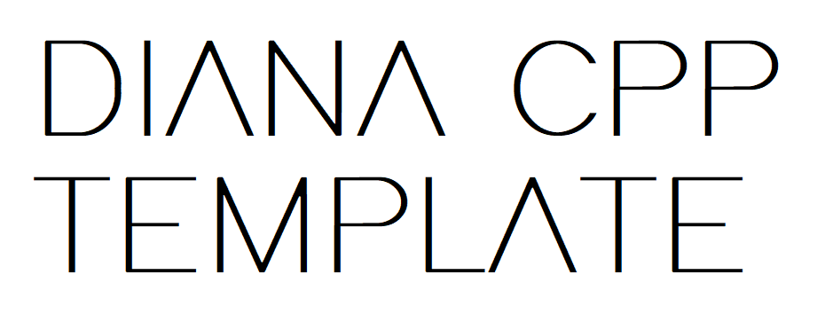

# DIANA-TemplateCPP
<p align="center">
    
</p>

### v2.0.0
*Insert here a brief description of the project.* <br>
DIANA-TemplateCPP is the official C++/Cmake template for DIANA Software repositories. It is intended as a *starting point* for the development of new repositories. It uses advanced CMake functionalities to make the project compliant with the [DIANA Software standard](https://github.com/team-diana/CS-Docs/tree/master/DIANA%20Software/Conventions), to handlefiles, installation and tests. This template is meant to be used in CLion IDE.

### Workflows
|      | **Build and install** | **Makefile standard commands** |
|----------|----------|-------------------------|
|  **Master**    |     |           |
|  **Develop**    |               |   |

## Description
Insert here some detailed description about your software. Here are some suggestions:
- **Library**: *How to include in Cmake? What are the main functions of the library? How do they work? Simple code examples*
- **Program**: *How does it work? How to use it ? Program arguments ? What are the Mqtt topics it uses? Are there any ShmemKeys? Does it have particular dependencies?*
- **Service**: How does it work? Is it possible to use it as standalone? Does it have dependencies? Are there arguments to pass in the standalone version?

*In general, think as you were the user, and not a developer: what are the info you will need to start using your modules as fast as possible?*
*Also, remember to provide links to documentation (Cs docs) and external information, if needed.*
## Make Targets
### Install Dependencies

#### Configure

```bash
make configure
```
### Build project
#### Generate Makefiles/Cmake Project

```bash
make generate
```
#### Clean (deletes build folder)

```bash
make clean
```

#### Build project - debug configuration

```bash
make build
```

#### Build project - Release configuration

```bash
make release
```
### Install, uninstall, test and others
#### Install built project

```bash
make install
```
#### Uninstall built project
Cleans all the files installed by the project.
```bash
make uninstall
```

#### Run Tests

```bash
make test
```

#### Generate Doxygen documentation

```bash
make docs
```

### Other makefile targets
Set here, if needed, "custom" make targets for the project.
### Run ExampleProgram

```bash
make run_ExampleProgram
```
### Run ExampleService (as a standalone)

```bash
make run_ExampleService
```
